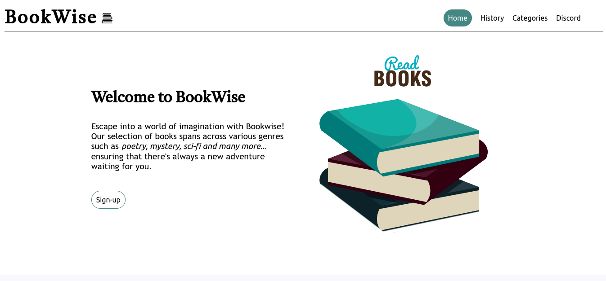
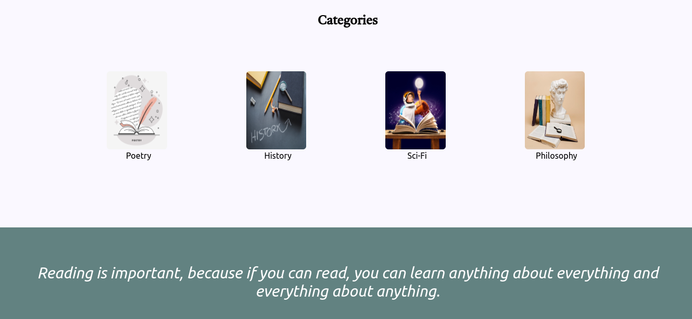

- [Overview](#overview)
  - [Screenshot](#screenshot)
  - [Links](#links)
- [My process](#my-process)
  - [Built with](#built-with)
  - [What I learned](#what-i-learned)
  - [Continued development](#continued-development)
  - [Useful resources](#useful-resources)
- [Author](#author)
- [Acknowledgments](#acknowledgments)

# Overview
BookWise is a website that illustrates the importance of reading and also provides a catalogue of books for users to access

## Screenshot

# My process

## Built with
* Semantic HTML
* CSS

# Continued development
BookWise will be further styled, to be more attractive, user-friendly and responsive across devices.
Also, further JS logic will be integrated to the code to make for an option to get books and bring together people with shared interest in reading across their favorite genres.

## Author
* [KingHorey](https://www.twitter.com/kinghorey)

